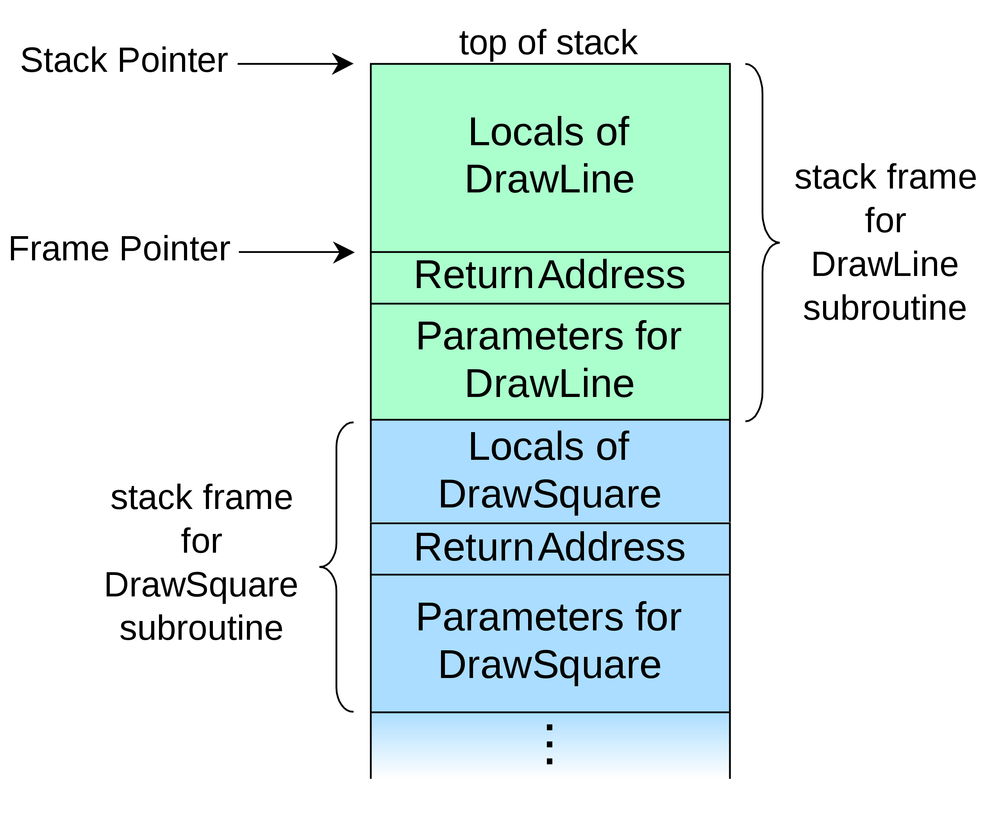
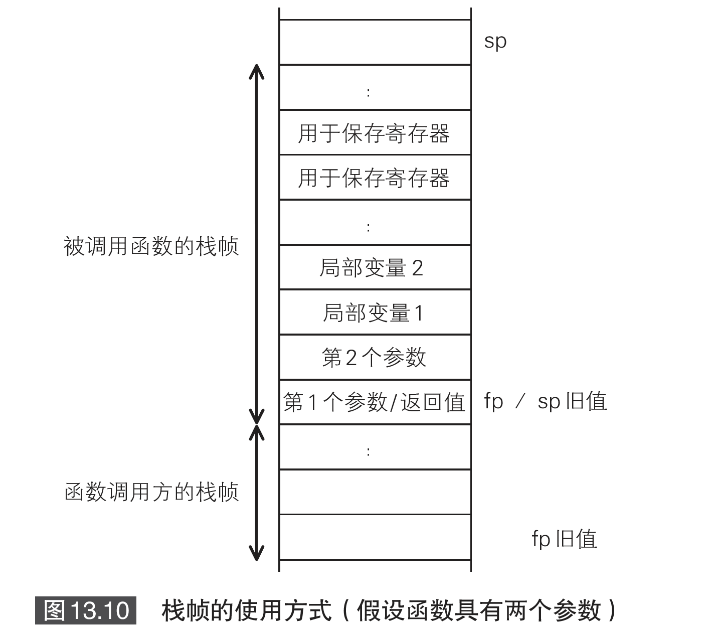

# 两周自制脚本语言

[stone](https://github.com/chibash/stone) used `gluonj` which makes the code very trivial, so I re-implement the code to make it clean for myself.

## run

```bash
# compile
mvn clean package
# run
java -cp target/stone_interpreter-1.0-SNAPSHOT-jar-with-dependencies.jar com.xxx.stone.StdInParser < counter.stone
```

## stone EBNF

```EBNF
primary     ::= ("fun" param_list block | "(" expr ")" | NUMBER | IDENTIFIER | STRING) { postfix }
factor      ::= "-" primary | primary
expr        ::= factor { OP factor }
block       ::= "{" [ statement ] {(";" | EOL) [ statement ]} "}"
statement   ::= "if" expr block ["else" block]
                      | "while" expr block
                      | simple
param       ::= IDENTIFIER
params      ::= IDENTIFIER { "," param }
param_list  ::= "(" [ params ] ")"
def         ::= "def" IDENTIFIER param_list block
args        ::= expr { "," expr }
simple      ::= expr [ args ]
member      ::= def | simple
class_body  ::= "{" [ member] { (";" | EOL) | [ member ] } "}"
defClass    ::= "class" IDENTIFIER [ "extends" IDENTIFIER] class_body
postfix     ::= "." IDENTIFIER | "(" args ")"
program     ::= [ def | statement | defClass ] ( ";" | EOL )
```

## BNF

```EBNF
factor: 	NUMBER | "(" expression ")"
term:		factor { ("*" | "/") factor }
expression:	term { ("+" | "-") term }
```

### EBNF symbol

[Extended Backus–Naur form](https://en.wikipedia.org/wiki/Extended_Backus%E2%80%93Naur_form)

| symbol    | description      |
|-----------|------------------|
| =         | definition       |
| ,         | concatenation    |
| ;         | termination      |
| &#123;    | alternation      |
| [...]     | optional         |
| {...}     | repetition       |
| (...)     | grouping         |
| "..."     | terminal string  |
| '...'     | terminal string  |
| (* ... *) | comment          |
| ? ... ?   | special sequence |
| -         | exception        |

### EBNF example

```EBNF
digit excluding zero = "1" | "2" | "3" | "4" | "5" | "6" | "7" | "8" | "9" ;
digit                = "0" | digit excluding zero ;
```

```EBNF
twelve                          = "1", "2" ;
two hundred one                 = "2", "0", "1" ;
three hundred twelve            = "3", twelve ;
twelve thousand two hundred one = twelve, two hundred one ;
```

Expressions that may be omitted or repeated can be represented through curly braces { ... }:

```EBNF
natural number = digit excluding zero, { digit } ;
```

In this case, the strings 1, 2, ..., 10, ..., 10000, ... are correct expressions. To represent this, everything that is set within the curly braces may be repeated arbitrarily often, including not at all.

An option can be represented through squared brackets [ ... ]. That is, everything that is set within the square brackets may be present just once, or not at all:

```EBNF
integer = "0" | [ "-" ], natural number ;
```

## Stone 虚拟机的虚拟机器语言

| instruction      | description                                                                         |
|------------------|-------------------------------------------------------------------------------------|
| iconst int32 reg | 将整数值 int32 保存到reg                                                            |
| bconst int8 reg  | 将整数值 int8 保存到 reg                                                            |
| sconst int16 reg | 将字符常量区的第 int16 个 字符串字面量保存至 reg                                    |
| move src dst     | 在栈与寄存器，或者寄存器与寄存器之间进行赋值操作（src 和 dst 可以是 reg 或者 int8） |
| gmove src dst    | 在堆与寄存器之间进行赋值操作（src 和 dst 可以是 reg 或者 int16）                    |
| ifzero reg int16 | 如果 reg 的值是 0，则跳转到 int16 分支                                              |
| goto int16       | 无条件跳转到 int16 分支                                                             |
| call reg int8    | 调用函数 reg，该寄存器将调用 int8 个参数（call 之后的指令地址将被保存到 ret）       |
| return           | 跳转至 ret 寄存器存储的分支地址                                                     |
| `save int8`      | 将寄存器的值转移到栈中，同时修改寄存器 fp 与 sp 的值                                |
| `restore int8`   | 还原之前转移至栈中的寄存器地址                                                      |
| neg reg          | 翻转 reg 中保存的值                                                                 |
| add reg1 reg2    | 计算reg1 + reg2 后保存至reg 1                                                      |
| sub reg1 reg2    | 计算reg1-reg2后保存至reg1                                                           |
| mul reg1 reg2    | 计算reg1×reg2后保存至reg1                                                           |
| div reg1 reg2    | 计算reg1÷reg2后保存至reg1                                                           |
| rem reg1 reg2    | 计算reg1÷reg2的余数后将余数保存至reg1                                               |
| equal reg1 reg2  | 如果reg1=reg2则将reg1赋值为1，否则赋值为0                                           |
| more reg1 reg2   | 如果reg1>reg2则将reg1赋值为1，否则赋值为0                                           |
| less reg1 reg2   | 如果reg1 `<` reg2则将reg1赋值为1，否则赋值为0                                           |

### call stack layout



A call stack is used for several related purposes, but **the main reason for having one is to keep track of the point to which each active subroutine should return control when it finishes executing**. An active subroutine is one that has been called, but is yet to complete execution, after which control should be handed back to the point of call. Such activations of subroutines may be nested to any level (recursive as a special case), hence the stack structure. For example, if a subroutine `DrawSquare` calls a subroutine `DrawLine` from four different places, DrawLine must know where to return when its execution completes. To accomplish this, the address following the instruction that jumps to DrawLine, the return address, is pushed onto the top of the call stack with each call.

